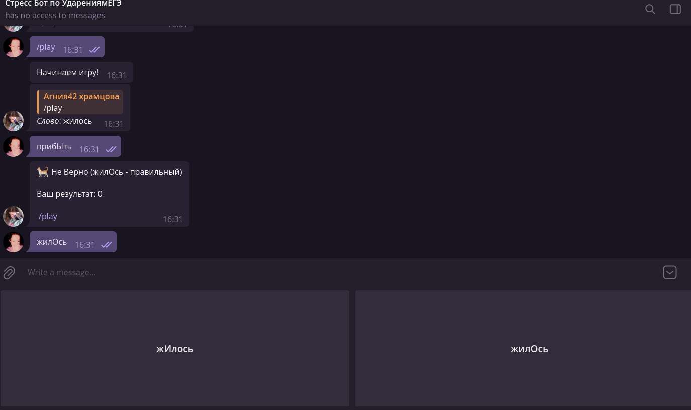

# 👌StressEge Telegram bot



Telegram Бот для усиленной подготовки у ЕГЭ по Русскому (Задание№4)

Я использовал официальную базу ФИПИ, в котором около 300 слов.  Игра простая: вы нажимаете /play вам дают слово, ваша цель отгадать правильное ударение, если отгадали +1 очко, если нет, то игра останавливается.

Игра должна помочь вам в ЕГЭ (надеюсь).  Я создал её за 1час на Python Aiogram, возможно бот чуть где-то тупит.

## Как работает?

Существует файл [./dict.txt](./dict.txt).  Его формат очень прост: это просто дофигище слов разделённые новой строкой.  В каждом слове все буквы прописные, кроме ударной гласной, которая должна быть заглавной, таким образом Бот понимает что именно там поставлено ударение.  Также в одной строчке со словом в скобках может быть пояснение, данное пояснение бот прочитает и покажет пользователю только один раз, не повторит, его перебирая все возможные ударные гласные.

Работу бота можно описать следующим образом:

1. Пользователь вводит команду /play
2. В хеш-таблице (словаре, `dict`) по Telegram ID сохраняется его текущий счёт (0).  Все следующие сообщения ботом будут прочитаны, как ответы пользователя на вопрос
3. После каждого ответа или сразу после команды /play Бот пришлёт `ReplyKeyboard` с вариантами, где может стоять ударная гласная.
4. При верном ответе счёт в словаре увеличится, при неправильном Бот подведёт итоги и удалит ID из хеш-таблицы

Когда ударения загадываются, правильные ответы сохраняются также в словаре, чтобы после следующего сообщения пользователя понять верный этот ответ или нет

TODO: заменить хеш-таблицу структурой, позволяющую отвечать запросы при нескольких потока (возможно Redis или что-то полегче?)

## Запустить на своём компьютере

Программа ищет Telegram Token Бота в переменной окружения `STRESS_BOT_TOKEN`.  Вам стоит создать бота и найти этот токен, потом можно его и сохранить в переменной

Ещё установите единственную зависимость:

```shell
pip install aiogram
```
